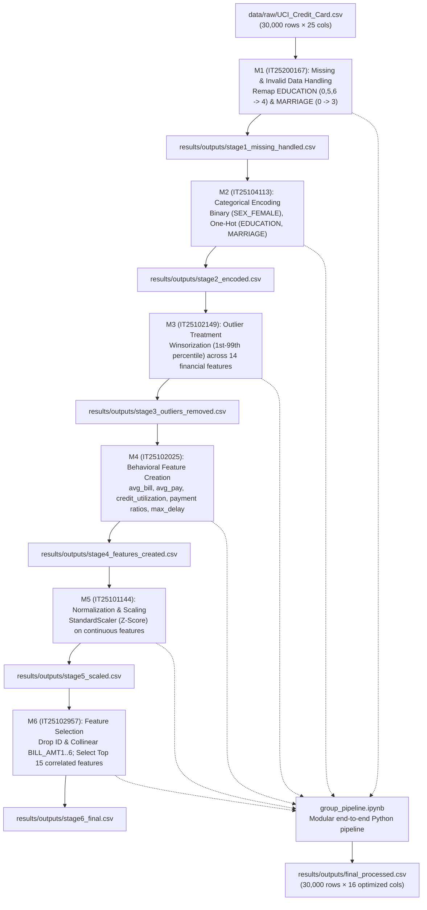

# AIML Group Assignment: Credit Card Default Preprocessing Pipeline

[](https://archive.ics.uci.edu/dataset/350/default+of+credit+card+clients)
[](https://colab.research.google.com/)
[]()

This repository contains the end-to-end data preprocessing pipeline and individual member notebooks for the **Default of Credit Card Clients** dataset (Taiwan, April–September 2005), completed for the AIML Group Assignment. The project implements a sequential multi-stage pipeline designed to prepare noisy, dirty, and heavy-tailed credit card behavioral data for predictive classification.

---

## 1. Dataset Overview

- **Source:** [UCI Machine Learning Repository — Default of Credit Card Clients Dataset](https://archive.ics.uci.edu/dataset/350/default+of+credit+card+clients)
- **Observations:** 30,000 credit card clients
- **Raw Features:** 24 features (demographic attributes, credit limits, 6-month repayment histories, 6-month bill statements, and 6-month payment amounts)
- **Target Feature:** `default payment next month` (binary: `1` = default, `0` = non-default; overall default rate: **22.12%**)
- **Data Integrity Profile:** While there are no literal missing values (`NaN`/`None`), the dataset contains undocumented/dirty categorical codes (`EDUCATION`: 0, 5, 6; `MARRIAGE`: 0), severe right-skewed monetary distributions, extreme payment spikes, and high multicollinearity across monthly bill statements.

---

## 2. Group Members & Preprocessing Assignments

Each member implemented and justified a distinct data preprocessing technique in an individual notebook, passing intermediate outputs sequentially to ensure true collaborative integration:

| Member    | Student IT Number | Assigned Preprocessing Technique                    | Individual Notebook Filename                                                                                     | Input Data                     | Output CSV                                    |
| --------- | ----------------- | --------------------------------------------------- | ---------------------------------------------------------------------------------------------------------------- | ------------------------------ | --------------------------------------------- |
| **M1**    | `IT25200167`      | **Missing / Invalid Data Handling**                 | [`IT25200167_MissingData.ipynb`](file:///notebooks/IT25200167_MissingData.ipynb)                                 | `data/raw/UCI_Credit_Card.csv` | `results/outputs/stage1_missing_handled.csv`  |
| **M2**    | `IT25104113`      | **Encoding Categorical Variables**                  | [`IT25104113_Encoding.ipynb`](file:///notebooks/IT25104113_Encoding.ipynb)                                       | `stage1_missing_handled.csv`   | `results/outputs/stage2_encoded.csv`          |
| **M3**    | `IT25102149`      | **Outlier Detection & Treatment**                   | [`IT25102149_OutlierRemoval.ipynb`](file:///notebooks/IT25102149_OutlierRemoval.ipynb)                           | `stage2_encoded.csv`           | `results/outputs/stage3_outliers_removed.csv` |
| **M4**    | `IT25102025`      | **Feature Engineering — Creation**                  | [`IT25102025_FeatureEngineering_Creation.ipynb`](file:///notebooks/IT25102025_FeatureEngineering_Creation.ipynb) | `stage3_outliers_removed.csv`  | `results/outputs/stage4_features_created.csv` |
| **M5**    | `IT25101144`      | **Normalization & Feature Scaling**                 | [`IT25101144_Scaling.ipynb`](file:///notebooks/IT25101144_Scaling.ipynb)                                         | `stage4_features_created.csv`  | `results/outputs/stage5_scaled.csv`           |
| **M6**    | `IT25102957`      | **Feature Selection & Multicollinearity Filtering** | [`IT25102957_FeatureSelection_PCA.ipynb`](file:///notebooks/IT25102957_FeatureSelection_PCA.ipynb)               | `stage5_scaled.csv`            | `results/outputs/stage6_final.csv`            |
| **Group** | `All Members`     | **Unified Integrated Pipeline**                     | [`group_pipeline.ipynb`](file:///group_pipeline.ipynb)                                                           | `data/raw/UCI_Credit_Card.csv` | `results/outputs/final_processed.csv`         |

---

## 3. Sequential Pipeline Architecture



---

## 4. Preprocessing Stages & Domain Justifications

### Stage 1 (M1 - IT25200167): Missing & Invalid Data Handling

- **Problem:** Undocumented codes `0, 5, 6` in `EDUCATION` (345 rows) and `0` in `MARRIAGE` (54 rows).
- **Strategy:** Re-coded undocumented categories into the "Others" category (`EDUCATION = 4`, `MARRIAGE = 3`).
- **Why First:** Prevents the generation of spurious dummy columns or invalid arithmetic rank weights. Preserves all 30,000 rows without discarding defaulting clients.
- **EDA Plot:** [`m1_invalid_codes_distribution.png`](file:///results/eda_visualizations/m1_invalid_codes_distribution.png)

### Stage 2 (M2 - IT25104113): Categorical Variable Encoding

- **Problem:** Categorical columns have no true linear metric spacing. Graduate School (`1`) is smaller than High School (`3`), which would distort linear regressors.
- **Strategy:** Binary indicator for `SEX` (`SEX_FEMALE`), One-Hot Encoding for `EDUCATION` (`EDUCATION_1..4`) and `MARRIAGE` (`MARRIAGE_1..3`).
- **EDA Plot:** [`m2_categorical_default_rates.png`](file:///results/eda_visualizations/m2_categorical_default_rates.png)

### Stage 3 (M3 - IT25102149): Outlier Detection & Treatment

- **Problem:** Balance amounts and payments have extreme positive/negative anomalies (e.g. `PAY_AMT1` up to NT$ 873,552 vs 99th percentile of NT$ 66,111). Hard IQR deletion would drop >25% of all rows, severely under-sampling defaulters.
- **Strategy:** Winsorization / Soft Capping at the 1st and 99th percentiles across all 14 continuous financial features.
- **Result:** Zero data loss (30,000 rows retained) while bounding distortion on model gradients.
- **EDA Plot:** [`m3_outlier_boxplots.png`](file:///results/eda_visualizations/m3_outlier_boxplots.png)

### Stage 4 (M4 - IT25102025): Feature Engineering — Creation

- **Problem:** Static monthly balances do not reveal underlying financial stress or cash flow habits.
- **Strategy:** Derived 13 behavioral features:
  - `avg_bill_amt` & `avg_pay_amt`: Smoothed expenditure and liquidity.
  - `credit_utilization`: $\frac{\text{avg\_bill\_amt}}{\text{LIMIT\_BAL}}$ (classic debt strain metric).
  - `payment_ratio_1..6` & `avg_payment_ratio`: Payment-to-bill fulfillment ratios.
  - `bill_to_limit_ratio`: Recent credit exposure.
  - `max_delay` & `delay_count`: Delinquency severity metrics.
- **EDA Plot:** [`m4_credit_utilization_default.png`](file:///results/eda_visualizations/m4_credit_utilization_default.png)

### Stage 5 (M5 - IT25101144): Normalization & Feature Scaling

- **Problem:** Credit limits (up to NT$ 500,000+) dwarf unit ratios ($0.0$ to $5.0$). Unscaled features bias distance-based metrics (KNN, SVM, PCA) and gradient descent algorithms.
- **Strategy:** Standardized all 24 continuous features using `StandardScaler` ($z = \frac{x - \mu}{\sigma}$). Categorical binary indicators remain unscaled.
- **EDA Plot:** [`m5_scaling_comparison.png`](file:///results/eda_visualizations/m5_scaling_comparison.png)

### Stage 6 (M6 - IT25102957): Feature Selection & Multicollinearity Filtering

- **Problem:** `BILL_AMT1` through `BILL_AMT6` have pairwise correlations exceeding $0.85$–$0.95$ (extreme multicollinearity), and the expanded feature space (43 features) risks dimensionality issues for complex classifiers.
- **Strategy:**
  1. **Drop `ID`**: Arbitrary row index, prevents overfitting.
  2. **Drop Collinear Raw Bills (`BILL_AMT1..6`)**: Redundant information summarized cleanly by M4 features (`credit_utilization`, `avg_bill_amt`).
  3. **Target-Supervised Correlation Selection**: Ranked features and retained Top 15 highest-signal features (`delay_count`, `max_delay`, `PAY_0..6`, `LIMIT_BAL`, `avg_pay_amt`, `avg_payment_ratio`, `credit_utilization`, `PAY_AMT1..3`).
- **EDA Plot:** [`m6_feature_selection_ranking.png`](file:///results/eda_visualizations/m6_feature_selection_ranking.png)

---

## 5. Repository Structure

```
Default-creditcard-client/
├── README.md                                         # Comprehensive assignment documentation
├── PROJECT_PLAN.md                                   # Original project brief and grading rubrics
├── UCI_Credit_Card.xls                               # Original raw Excel dataset
├── group_pipeline.ipynb                              # Integrated end-to-end master pipeline
├── data/
│   ├── raw/
│   │   └── UCI_Credit_Card.csv                       # Converted clean CSV source (30,000 rows × 25 cols)
│   └── external/                                     # External reference directory
├── notebooks/
│   ├── IT25200167_MissingData.ipynb                  # Stage 1: Missing & Invalid Data Handling (M1)
│   ├── IT25104113_Encoding.ipynb                     # Stage 2: Categorical Variable Encoding (M2)
│   ├── IT25102149_OutlierRemoval.ipynb               # Stage 3: Outlier Treatment & Winsorization (M3)
│   ├── IT25102025_FeatureEngineering_Creation.ipynb  # Stage 4: Behavioral Feature Engineering (M4)
│   ├── IT25101144_Scaling.ipynb                      # Stage 5: Feature Normalization & Standardization (M5)
│   └── IT25102957_FeatureSelection_PCA.ipynb         # Stage 6: Feature Selection (M6)
└── results/
    ├── eda_visualizations/                           # High-resolution exported EDA figures
    │   ├── m1_invalid_codes_distribution.png
    │   ├── m2_categorical_default_rates.png
    │   ├── m3_outlier_boxplots.png
    │   ├── m4_credit_utilization_default.png
    │   ├── m5_scaling_comparison.png
    │   └── m6_feature_selection_ranking.png
    ├── logs/                                         # Execution and audit logs
    └── outputs/                                      # Intermediate and final CSV artifacts
        ├── stage1_missing_handled.csv
        ├── stage2_encoded.csv
        ├── stage3_outliers_removed.csv
        ├── stage4_features_created.csv
        ├── stage5_scaled.csv
        ├── stage6_final.csv
        └── final_processed.csv                       # Ready-to-model final dataset (30,000 × 16)
```

---

## 6. How to Run

### Method A: Running in Google Colab (Recommended)

1. Upload the entire project folder to your Google Drive (e.g. `MyDrive/Default-creditcard-client`).
2. Open Google Colab and mount Google Drive:
   ```python
   from google.colab import drive
   drive.mount('/content/drive')
   import os
   os.chdir('/content/drive/MyDrive/Default-creditcard-client')
   ```
3. To execute the combined pipeline: Open and run [`group_pipeline.ipynb`](file:///group_pipeline.ipynb).
4. To inspect or grade individual work: Open and run the notebooks in sequential order:
   - `IT25200167_MissingData.ipynb`
   - `IT25104113_Encoding.ipynb`
   - `IT25102149_OutlierRemoval.ipynb`
   - `IT25102025_FeatureEngineering_Creation.ipynb`
   - `IT25101144_Scaling.ipynb`
   - `IT25102957_FeatureSelection_PCA.ipynb`

### Method B: Running Locally via Jupyter / Python

1. Ensure dependencies are installed:
   ```bash
   pip install pandas numpy matplotlib seaborn scikit-learn
   ```
2. Launch Jupyter Lab / Notebook:
   ```bash
   jupyter lab
   ```
3. Open and run `group_pipeline.ipynb` or any individual notebook in `notebooks/`.
